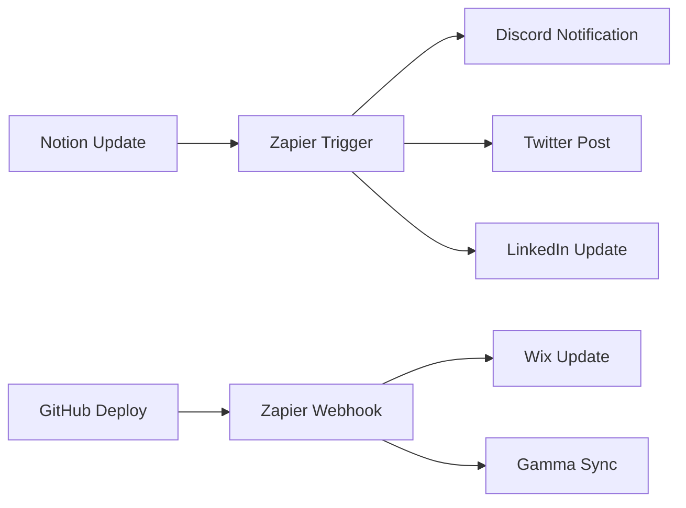

# 🚀 WIRED CHAOS - Third-Party Integration Setup

This document provides complete setup instructions for integrating WIRED CHAOS with Gamma, Notion, Wix, and Zapier.

## 🎯 Gamma Integration

### Setup Steps:
1. **Create Gamma Account**: Visit [gamma.app](https://gamma.app) and create an account
2. **Generate API Key**: 
   - Go to Settings > Developer > API Keys
   - Create new API key with "Read/Write" permissions
3. **GitHub Secrets**: 
   - Add `GAMMA_API_KEY` to repository secrets
   - Add `GAMMA_PROJECT_ID` for project identification
4. **Configuration**:
   - Configure webhook endpoint: `https://wired-chaos.pages.dev/api/gamma/webhook`
   - Set webhook events: presentation.created, presentation.updated, presentation.deleted

### Features:
- **AI-Powered Presentations**: Automated slide generation from content
- **WIRED CHAOS Templates**: Pre-designed themes (Cyber Dark, Glitch, Electric)
- **Real-time Collaboration**: Multi-user editing with conflict resolution
- **Data Integration**: Live charts and visualizations from KV storage
- **Export Automation**: PDF, PowerPoint, HTML, PNG formats
- **WIX Sync**: Bi-directional content synchronization
- **Version Control**: Presentation history and rollback

### Quick Start:
```typescript
import { GammaAPIClient } from './wix-gamma-integration/gamma/api/gamma-client';

const gamma = new GammaAPIClient('YOUR_API_KEY');

// Create presentation
const presentation = await gamma.createPresentation(
  'My Presentation',
  [
    { type: 'title', title: 'Welcome', content: 'WIRED CHAOS' },
    { type: 'content', title: 'Overview', content: '...' }
  ]
);

// Export as PDF
const pdf = await gamma.exportPresentation(presentation.data.id, 'pdf');
```

### Documentation:
- [Full GAMMA Integration Guide](wix-gamma-integration/docs/gamma-integration.md)
- [Templates & Themes](wix-gamma-integration/gamma/templates/templates.ts)
- [API Client](wix-gamma-integration/gamma/api/gamma-client.ts)

## 📝 Notion Integration

### Setup Steps:
1. **Create Notion Integration**: 
   - Visit [notion.so/my-integrations](https://notion.so/my-integrations)
   - Create new integration with "Read/Write" capabilities
2. **Database Setup**:
   - Create main content database
   - Share database with your integration
   - Copy database ID from URL
3. **GitHub Secrets**:
   - `NOTION_API_KEY`: Your integration token
   - `NOTION_DATABASE_ID`: Main content database ID

### Database Schema:
```
WIRED CHAOS Content Database
├── Title (Title)
├── Status (Select: Draft, Review, Published)
├── Category (Multi-select: Frontend, Backend, Blockchain, AI)
├── Content (Rich Text)
├── Tags (Multi-select)
├── Created (Created Time)
├── Updated (Last Edited Time)
└── Author (Person)
```

## 🌐 Wix Integration

### Setup Steps:
1. **Wix Developer Account**: Create account at [dev.wix.com](https://dev.wix.com)
2. **Create App**:
   - New App > Website Integration
   - Configure OAuth permissions (Site API, Data API, Members API)
3. **API Configuration**:
   - Enable Site API, Data API, and Webhooks
   - Set redirect URI: `https://wired-chaos.pages.dev/wix-callback`
   - Configure webhook URL: `https://wired-chaos.pages.dev/api/wix/webhook`
4. **GitHub Secrets**:
   - `WIX_APP_ID`: Your app ID
   - `WIX_APP_SECRET`: Your app secret
   - `WIX_SITE_ID`: Target site ID
   - `WIX_API_TOKEN`: API authentication token
   - `WIX_ACCESS_TOKEN`: OAuth access token

### Integration Features:
- **Security Headers**: Automatic CSP, CORS, X-Frame-Options
- **AR/VR Support**: WebXR model viewer for 3D content (GLB, USDZ, GLTF)
- **Analytics Tracking**: Real-time event tracking with WC-BUS integration
- **Form Processing**: Secure form handling with CSRF protection
- **Content Sync**: Bi-directional sync with GAMMA presentations
- **WIRED CHAOS Branding**: Pre-built components with cyber theme
- **Performance**: Cloudflare edge caching and optimization

### Quick Start:
```javascript
// In WIX Velo page code
import wixChaos from './public/wired-chaos-integration.js';

$w.onReady(function() {
  const chaos = wixChaos.initialize({
    apiBase: 'https://wired-chaos.pages.dev',
    apiKey: 'YOUR_API_KEY'
  });
  
  // Load AR model
  chaos.loadARModel('model-123', '#arViewer');
  
  // Track events
  chaos.trackEvent('page_view', { page: 'home' });
});
```

### Documentation:
- [Full WIX Integration Guide](wix-gamma-integration/docs/wix-integration.md)
- [Example Page Code](wix-gamma-integration/wix/pages/example-page.js)
- [Velo Integration Library](wix-gamma-integration/wix/velo/wired-chaos-integration.js)

## 🤖 Wix AI Bot Automation

### Overview
The Wix AI Bot integration provides automated workflows between GitHub and your Wix site, enabling:
- **Automated landing page updates** on PR merges
- **Real-time notifications** on deployments
- **Content synchronization** from GitHub to Wix
- **Webhook-driven automation** for custom workflows

### Setup Steps:

1. **Access Wix AI Bot**:
   - URL: https://manage.wix.com/dashboard/7aa81323-433d-4763-b6dc-5d98d409c459/custom-agent
   - Log in with your Wix account
   - Generate API credentials

2. **Configure GitHub Secrets**:
   ```bash
   # Required
   gh secret set WIX_API_TOKEN --body "your_wix_api_token"
   gh secret set WIX_SITE_ID --body "7aa81323-433d-4763-b6dc-5d98d409c459"
   
   # Optional
   gh secret set WIX_AI_BOT_URL --body "https://your-custom-bot-url.com"
   gh secret set WIX_WEBHOOK_SECRET --body "your_webhook_secret"
   ```

3. **Enable GitHub Workflow**:
   - Workflow file: `.github/workflows/wix-ai-bot-automation.yml`
   - Automatically triggers on PR merges, pushes, and deployments
   - Manual dispatch available for custom actions

4. **Configure Webhook** (Optional):
   - Go to Repository Settings → Webhooks → Add webhook
   - Payload URL: `https://wired-chaos.pages.dev/api/wix/webhook`
   - Content type: `application/json`
   - Events: Pull requests, Pushes, Deployment statuses

### Automation Features:

#### PR Merge → Landing Page Update
```bash
# Automatically triggered when PR is merged
# Updates Wix landing page with PR details
# Sends notifications to Discord/Telegram
```

#### Deployment → Notification
```bash
# Triggered on deployment completion
# Sends status notification to Wix site
# Updates deployment log on landing page
```

#### Manual Actions
```bash
# Update landing page manually
gh workflow run wix-ai-bot-automation.yml \
  -f action=update_landing_page \
  -f message="Custom update"

# Send notification
gh workflow run wix-ai-bot-automation.yml \
  -f action=send_notification \
  -f message="Important announcement"

# Sync content
gh workflow run wix-ai-bot-automation.yml \
  -f action=sync_content

# Test connection
gh workflow run wix-ai-bot-automation.yml \
  -f action=test_connection
```

### API Client Usage:

```javascript
// Import client
import { WixAIBotClient } from './wix-gamma-integration/wix/ai-bot/wix-ai-bot-client.js';

// Initialize
const client = new WixAIBotClient({
  apiToken: process.env.WIX_API_TOKEN,
  siteId: process.env.WIX_SITE_ID,
  webhookSecret: process.env.WIX_WEBHOOK_SECRET
});

// Update landing page
await client.updateLandingPage({
  title: 'New Feature Released',
  content: '<h1>Announcement</h1><p>Details...</p>',
  metadata: { version: '1.0' }
});

// Send notification
await client.sendNotification({
  message: 'Deployment completed',
  type: 'success'
});

// Test connection
await client.testConnection();
```

### Testing:

```bash
# Run end-to-end test
cd wix-gamma-integration/examples/scripts
./test-e2e.sh

# View example payloads
ls wix-gamma-integration/examples/payloads/
# - pr-merge.json
# - deployment.json
# - content-sync.json
# - manual-action.json
```

### Monitoring:

- **GitHub Actions**: View workflow runs in Actions tab
- **Discord Notifications**: Automatic alerts on success/failure
- **Telegram Notifications**: Real-time updates on integrations
- **Worker Logs**: `wrangler tail --env production`

### Documentation:
- [Wix AI Bot Automation Guide](wix-gamma-integration/docs/wix-ai-bot-automation.md)
- [API Client Reference](wix-gamma-integration/wix/ai-bot/wix-ai-bot-client.js)
- [Example Event Payloads](wix-gamma-integration/examples/payloads/)
- [Test Automation Scripts](wix-gamma-integration/examples/scripts/)

### Security:
- All API tokens stored in GitHub Secrets
- HMAC signature verification for webhooks
- Rate limiting and retry logic
- Secure TLS 1.3 communication
- Audit logging in Cloudflare KV

### Troubleshooting:
- **401 Unauthorized**: Check WIX_API_TOKEN is set correctly
- **429 Rate Limited**: Automatic retry with exponential backoff
- **500 Server Error**: Check Wix AI Bot dashboard status
- **Webhook Failed**: Verify webhook secret matches configuration

## ⚡ Zapier Integration

### Setup Steps:
1. **Zapier Account**: Create account at [zapier.com](https://zapier.com)
2. **Create Zaps**:
   - **Notion → Discord**: New Notion page triggers Discord notification
   - **GitHub → Wix**: New deployment triggers Wix content update
   - **Cloudflare → Social**: New deployment triggers social media posts
3. **Webhook Configuration**:
   - Set webhook URL: `https://hooks.zapier.com/hooks/catch/YOUR_HOOK_ID/`
   - Configure authentication headers

### Automation Workflows:


## 🔐 GitHub Secrets Configuration

Add these secrets to your repository settings:

### Cloudflare:
- `CLOUDFLARE_API_TOKEN`: Your Cloudflare API token
- `CLOUDFLARE_ACCOUNT_ID`: Your account ID
- `CLOUDFLARE_PROJECT_NAME`: Pages project name
- `CLOUDFLARE_ADMIN_TOKEN`: Admin-level token for KV operations

### Social Media:
- `X_API_KEY`: Twitter/X API key
- `X_API_SECRET`: Twitter/X API secret
- `X_ACCESS_TOKEN`: Your access token
- `X_ACCESS_TOKEN_SECRET`: Your access token secret
- `LINKEDIN_ACCESS_TOKEN`: LinkedIn API token
- `LINKEDIN_ACTOR_URN`: Your LinkedIn actor URN

### Integrations:
- `NOTION_API_KEY`: Notion integration token
- `NOTION_DATABASE_ID`: Main content database ID
- `GAMMA_API_KEY`: Gamma application API key
- `WIX_APP_ID`: Wix application ID
- `WIX_APP_SECRET`: Wix application secret
- `WIX_SITE_ID`: Target Wix site ID
- `WIX_API_TOKEN`: Wix API authentication token (for AI Bot)
- `WIX_ACCESS_TOKEN`: Wix OAuth access token
- `WIX_AI_BOT_URL`: Custom Wix AI Bot URL (optional)
- `WIX_WEBHOOK_SECRET`: Webhook signature secret (optional)
- `ZAPIER_WEBHOOK_URL`: Zapier webhook endpoint

### Communication:
- `DISCORD_WEBHOOK_URL`: Discord webhook for notifications
- `TELEGRAM_BOT_TOKEN`: Telegram bot token (optional)
- `TELEGRAM_CHAT_ID`: Telegram chat ID (optional)

## 🧪 BETA Test Configuration

### Current BETA Features:
- ✅ Certificate NFT Minting (Ethereum, Solana, XRPL, Hedera, Dogecoin)
- ✅ 3D Brain Assistant with neural network visualization
- ✅ Vault33 Gatekeeper system
- ✅ Animated Motherboard UI
- ✅ Real-time blockchain integration

### BETA Test URLs:
- **Preview**: `https://wired-chaos-preview.pages.dev`
- **Staging**: `https://wired-chaos-staging.pages.dev`  
- **Production**: `https://wired-chaos.pages.dev`

### Test Scenarios:
1. **Certificate Minting Flow**:
   - Navigate to certificate minter
   - Select blockchain network
   - Complete minting process
   - Verify NFT creation

2. **Brain Assistant Interaction**:
   - Access 3D brain component
   - Test AI conversation features
   - Verify neural network animations

3. **Vault System**:
   - Test Discord/Telegram bot integration
   - Verify XRPL validator functionality
   - Check gamification features

## 🚀 Deployment Status

### Current Status:
- ✅ GitHub Actions workflows configured
- ✅ Cloudflare Pages integration ready
- ✅ Worker deployment configured
- ✅ Security vulnerabilities addressed
- ✅ BETA test environment active

### Manual Triggers:
```bash
# Trigger specific workflows
gh workflow run frontend-deploy
gh workflow run worker-deploy
gh workflow run content-sync
gh workflow run beta-test
```

### Monitoring:
- **GitHub Actions**: [Repository Actions](https://github.com/wiredchaos/wired-chaos/actions)
- **Cloudflare Dashboard**: Monitor deployment status and analytics
- **Discord**: Automated notifications for deployments and tests

## 🔧 Troubleshooting

### Common Issues:

1. **Deployment Failures**:
   - Check GitHub Actions logs
   - Verify all secrets are properly set
   - Ensure Cloudflare tokens have correct permissions

2. **Integration Errors**:
   - Validate API keys and tokens
   - Check webhook URLs and endpoints
   - Verify database/site permissions

3. **BETA Test Issues**:
   - Clear browser cache
   - Check console for JavaScript errors
   - Verify blockchain network connections

### Support Channels:
- **GitHub Issues**: Technical problems and bug reports
- **Discord**: Community support and real-time help
- **Documentation**: Detailed guides and API references

---

## 🔌 WIX/GAMMA Integration System

### Overview

The WIRED CHAOS WIX/GAMMA Integration System provides comprehensive connectivity between WIX websites and GAMMA presentations with the complete infrastructure.

**Location**: `wix-gamma-integration/`

### Key Components

1. **Cloudflare Worker** (`cloudflare/workers/integration-worker.js`)
   - API Gateway for WIX and GAMMA
   - Security headers (CSP, CORS, rate limiting)
   - Caching and performance optimization
   - Webhook handling

2. **WIX Velo Library** (`wix/velo/wired-chaos-integration.js`)
   - Client-side integration for WIX websites
   - AR/VR model viewer support
   - Analytics tracking
   - Form processing
   - WIRED CHAOS branding utilities

3. **GAMMA API Client** (`gamma/api/gamma-client.ts`)
   - TypeScript client for GAMMA API
   - Presentation creation and management
   - Template system with WIRED CHAOS themes
   - Export automation
   - Collaboration features

4. **Templates & Themes** (`gamma/templates/templates.ts`)
   - Cyber Dark theme
   - Glitch theme
   - Electric theme
   - Pre-built presentation templates

### Quick Deployment

```bash
# Navigate to integration directory
cd wix-gamma-integration

# Deploy (automated)
./deploy.ps1 -Environment production

# Or manually
wrangler deploy cloudflare/workers/integration-worker.js --env production
```

### Features

✨ **WIX Integration**
- Security headers (CSP, CORS, X-Frame-Options)
- AR/VR model viewer (GLB, USDZ, GLTF)
- Real-time analytics with WC-BUS
- Secure form processing
- WIRED CHAOS branding

✨ **GAMMA Integration**
- AI-powered presentation generation
- WIRED CHAOS branded templates
- Real-time collaboration
- Multi-format export (PDF, PPTX, HTML)
- Version control

✨ **Unified Features**
- Bi-directional content sync
- Single sign-on (SSO)
- Cloudflare edge caching
- Rate limiting & security
- Comprehensive documentation

### Documentation

- [WIX Integration Guide](wix-gamma-integration/docs/wix-integration.md)
- [GAMMA Integration Guide](wix-gamma-integration/docs/gamma-integration.md)
- [Deployment Guide](wix-gamma-integration/docs/deployment-guide.md)
- [Example Page Code](wix-gamma-integration/wix/pages/example-page.js)

### Required Secrets

Add these secrets for WIX/GAMMA integration:

```bash
# WIX
WIX_API_TOKEN=your_token
WIX_ACCESS_TOKEN=your_access_token

# GAMMA
GAMMA_API_KEY=your_api_key
GAMMA_PROJECT_ID=your_project_id
```

---

**Next Steps**: Configure your integrations, set GitHub secrets, and trigger your first deployment! 🚀