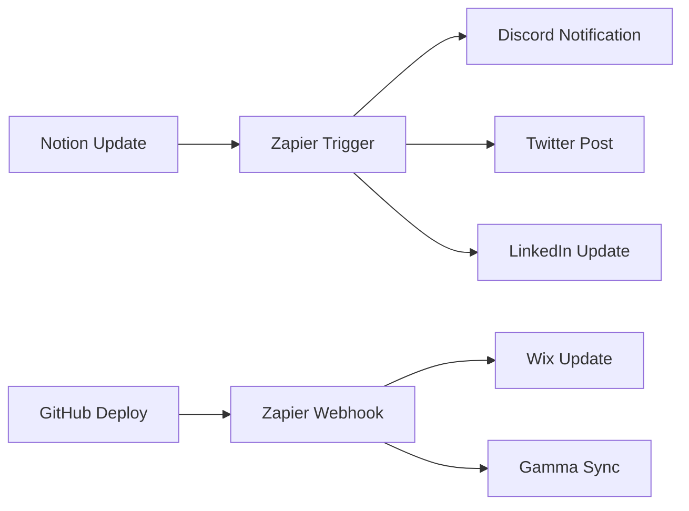

# 🚀 WIRED CHAOS - Third-Party Integration Setup

This document provides complete setup instructions for integrating WIRED CHAOS with Gamma, Notion, Wix, and Zapier.

## 🎯 Gamma Integration

### Setup Steps:
1. **Create Gamma Account**: Visit [gamma.app](https://gamma.app) and create an account
2. **Generate API Key**: 
   - Go to Settings > Developer > API Keys
   - Create new API key with "Read/Write" permissions
3. **GitHub Secret**: Add `GAMMA_API_KEY` to repository secrets
4. **Configuration**:
   - Add Gamma project ID to environment variables
   - Configure webhook endpoint: `https://your-worker.workers.dev/gamma-webhook`

### Features:
- Automated presentation generation from Notion content
- Real-time sync with WIRED CHAOS dashboard
- AI-powered slide creation and optimization

## 📝 Notion Integration

### Setup Steps:
1. **Create Notion Integration**: 
   - Visit [notion.so/my-integrations](https://notion.so/my-integrations)
   - Create new integration with "Read/Write" capabilities
2. **Database Setup**:
   - Create main content database
   - Share database with your integration
   - Copy database ID from URL
3. **GitHub Secrets**:
   - `NOTION_API_KEY`: Your integration token
   - `NOTION_DATABASE_ID`: Main content database ID

### Database Schema:
```
WIRED CHAOS Content Database
├── Title (Title)
├── Status (Select: Draft, Review, Published)
├── Category (Multi-select: Frontend, Backend, Blockchain, AI)
├── Content (Rich Text)
├── Tags (Multi-select)
├── Created (Created Time)
├── Updated (Last Edited Time)
└── Author (Person)
```

## 🌐 Wix Integration

### Setup Steps:
1. **Wix Developer Account**: Create account at [dev.wix.com](https://dev.wix.com)
2. **Create App**:
   - New App > Website Integration
   - Configure OAuth permissions
3. **API Configuration**:
   - Enable Site API, Data API, and Webhooks
   - Set redirect URI: `https://your-domain.pages.dev/wix-callback`
4. **GitHub Secrets**:
   - `WIX_APP_ID`: Your app ID
   - `WIX_APP_SECRET`: Your app secret
   - `WIX_SITE_ID`: Target site ID

### Integration Features:
- Automatic content publishing to Wix site
- Real-time deployment status updates
- Dynamic page generation from Notion content

## ⚡ Zapier Integration

### Setup Steps:
1. **Zapier Account**: Create account at [zapier.com](https://zapier.com)
2. **Create Zaps**:
   - **Notion → Discord**: New Notion page triggers Discord notification
   - **GitHub → Wix**: New deployment triggers Wix content update
   - **Cloudflare → Social**: New deployment triggers social media posts
3. **Webhook Configuration**:
   - Set webhook URL: `https://hooks.zapier.com/hooks/catch/YOUR_HOOK_ID/`
   - Configure authentication headers

### Automation Workflows:


## 🔐 GitHub Secrets Configuration

Add these secrets to your repository settings:

### Cloudflare:
- `CLOUDFLARE_API_TOKEN`: Your Cloudflare API token
- `CLOUDFLARE_ACCOUNT_ID`: Your account ID
- `CLOUDFLARE_PROJECT_NAME`: Pages project name
- `CLOUDFLARE_ADMIN_TOKEN`: Admin-level token for KV operations

### Social Media:
- `X_API_KEY`: Twitter/X API key
- `X_API_SECRET`: Twitter/X API secret
- `X_ACCESS_TOKEN`: Your access token
- `X_ACCESS_TOKEN_SECRET`: Your access token secret
- `LINKEDIN_ACCESS_TOKEN`: LinkedIn API token
- `LINKEDIN_ACTOR_URN`: Your LinkedIn actor URN

### Integrations:
- `NOTION_API_KEY`: Notion integration token
- `NOTION_DATABASE_ID`: Main content database ID
- `GAMMA_API_KEY`: Gamma application API key
- `WIX_APP_ID`: Wix application ID
- `WIX_APP_SECRET`: Wix application secret
- `WIX_SITE_ID`: Target Wix site ID
- `ZAPIER_WEBHOOK_URL`: Zapier webhook endpoint

### Communication:
- `DISCORD_WEBHOOK_URL`: Discord webhook for notifications

## 🧪 BETA Test Configuration

### Current BETA Features:
- ✅ Certificate NFT Minting (Ethereum, Solana, XRPL, Hedera, Dogecoin)
- ✅ 3D Brain Assistant with neural network visualization
- ✅ Vault33 Gatekeeper system
- ✅ Animated Motherboard UI
- ✅ Real-time blockchain integration

### BETA Test URLs:
- **Preview**: `https://wired-chaos-preview.pages.dev`
- **Staging**: `https://wired-chaos-staging.pages.dev`  
- **Production**: `https://wired-chaos.pages.dev`

### Test Scenarios:
1. **Certificate Minting Flow**:
   - Navigate to certificate minter
   - Select blockchain network
   - Complete minting process
   - Verify NFT creation

2. **Brain Assistant Interaction**:
   - Access 3D brain component
   - Test AI conversation features
   - Verify neural network animations

3. **Vault System**:
   - Test Discord/Telegram bot integration
   - Verify XRPL validator functionality
   - Check gamification features

## 🚀 Deployment Status

### Current Status:
- ✅ GitHub Actions workflows configured
- ✅ Cloudflare Pages integration ready
- ✅ Worker deployment configured
- ✅ Security vulnerabilities addressed
- ✅ BETA test environment active

### Manual Triggers:
```bash
# Trigger specific workflows
gh workflow run frontend-deploy
gh workflow run worker-deploy
gh workflow run content-sync
gh workflow run beta-test
```

### Monitoring:
- **GitHub Actions**: [Repository Actions](https://github.com/wiredchaos/wired-chaos/actions)
- **Cloudflare Dashboard**: Monitor deployment status and analytics
- **Discord**: Automated notifications for deployments and tests

## 🔧 Troubleshooting

### Common Issues:

1. **Deployment Failures**:
   - Check GitHub Actions logs
   - Verify all secrets are properly set
   - Ensure Cloudflare tokens have correct permissions

2. **Integration Errors**:
   - Validate API keys and tokens
   - Check webhook URLs and endpoints
   - Verify database/site permissions

3. **BETA Test Issues**:
   - Clear browser cache
   - Check console for JavaScript errors
   - Verify blockchain network connections

### Support Channels:
- **GitHub Issues**: Technical problems and bug reports
- **Discord**: Community support and real-time help
- **Documentation**: Detailed guides and API references

---

**Next Steps**: Configure your integrations, set GitHub secrets, and trigger your first deployment! 🚀